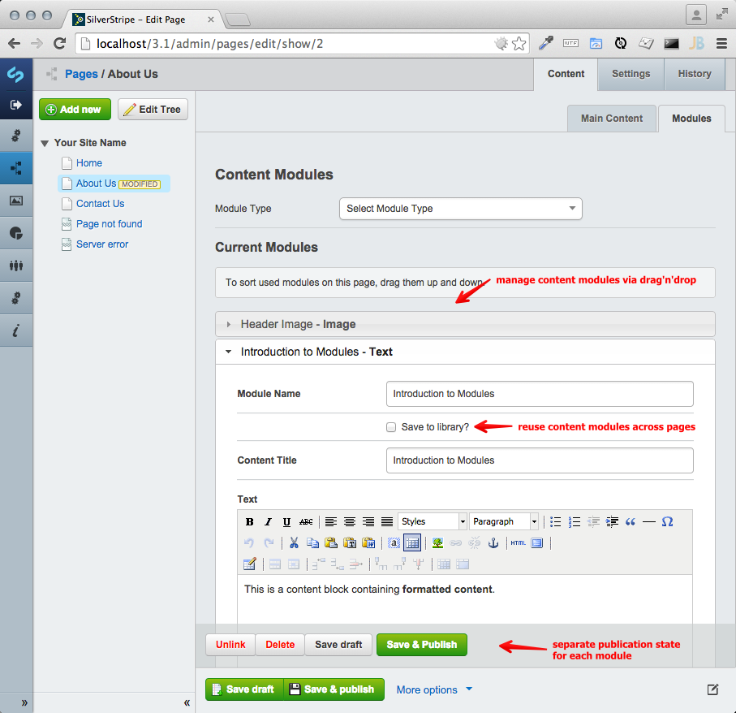
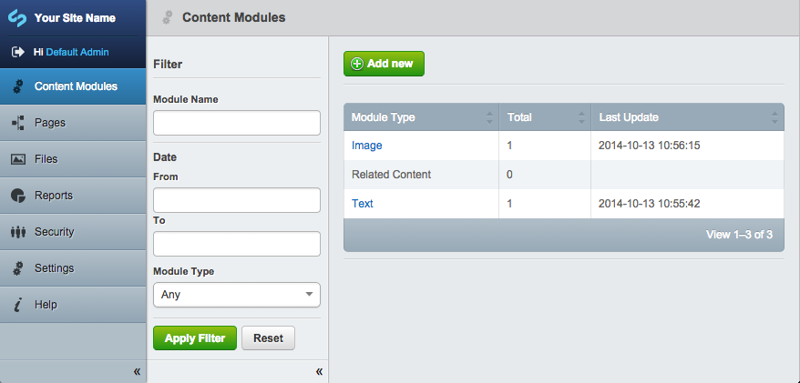
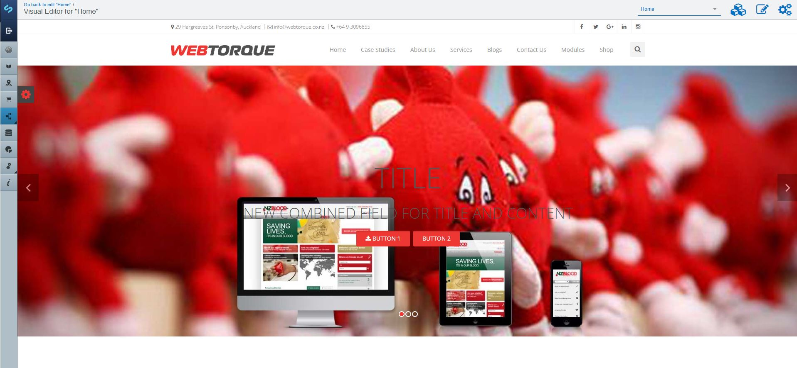
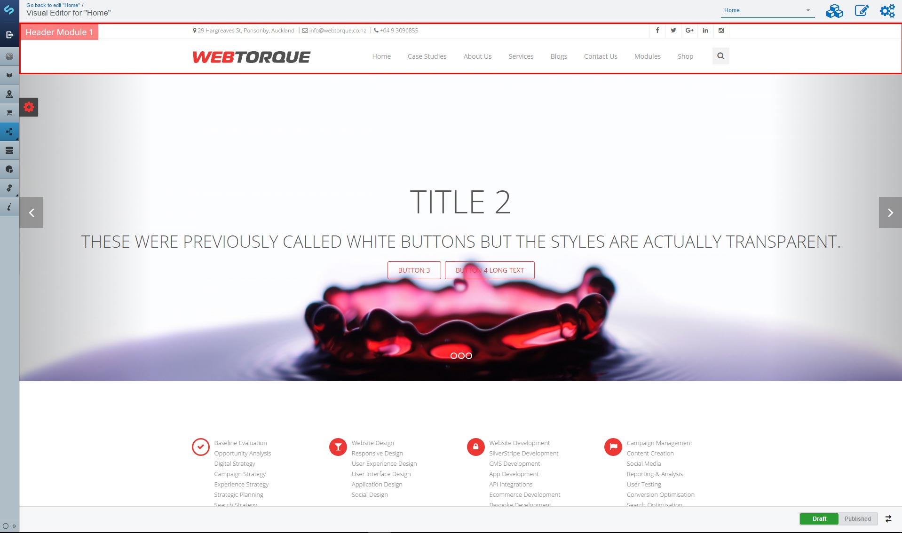
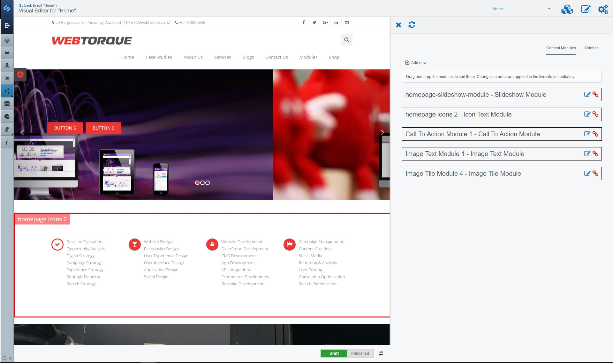

# In Page Content Modules

Alternative method to define content in the CMS, either replacing or amending
SilverStripe's core "page type" system. Allows authors to insert "content modules"
into a page as separate items, which enables more flexible content structures
both for sidebar-style content and flexible main content areas.

## Features

 * Define your own content modules by subclassing `ContentModule`
 * Sort modules via drag'n'drop
 * Save module drafts and publish independently of the parent page
 * List all used modules in a separate admin interface, and view their history
 * Reuse content modules on multiple pages by saving them to a library
 * Built-in modules: Text, Image (incl. cropping), related pages

## Screenshots





## Installation

Install the module into a `inpage-modules\` folder inside the webroot.

With composer - composer require webtorque7/inpage-modules

Then add the `ContentModule_PageExtension` class to either your base `Page` class or select subclasses.

```yml
# File: mysite/_config/config.yml
Page:
  extensions:
    - ContentModule_PageExtension
```

In your template (e.g. `themes/<yourtheme>/templates/Layout/Page.ss`) you can loop through
modules, and have them render with their own templates:

```html
<% loop $SortedContentModules %>
	$forTemplate
<% end_loop %>
```

## Templates

Create a template with same name as the module e.g. ImageModule.ss. Uses the same template
inheritance model as SiteTree objects to get the template. By convention it is a good idea to
add module templates to `themes/<yourtheme>/templates/modules`

## Multiple Sections

Multiple sections for modules can be added to a page creating a new base class e.g. SideBarModule
and setting up a many_many relationship

```php
$many_many = array(
    'SideBarModules' => 'SideBarModule'
);

$many_many_extraFields = array(
    'SideBarModules' => array(
        'Sort' => 'Int'
    )
);
```

Make sure to add the Sort field. To simplify getting the sorted modules you can overwrite the
many many function

```php
public function SideBarModules() {
    return $this->getManyManyComponents('SideBarModules')->sort('Sort');
}
```

## Visual Editor

A new feature is the visual editor. This adds the ability to edit modules while viewing the page. The editor is
presented with a preview and can click on a module to edit. This includes header and footer modules if it has been setup.






Access to this feature needs to be added manually. A simple way of doing this is by adding a button to the page form

```php
$fields->addFieldsToTab('Root.Main', array(
    LiteralField::create(
        'VisualEditorLink',
        sprintf(
            '<p><a href="%s" class="ss-ui-button .ss-ui-button-ajax visual-editor-button">Visual Editor</a></p>',
            Controller::join_links(singleton('VisualEditor')->Link('edit'), $this->ID)
        )
    )
));
```